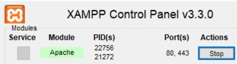
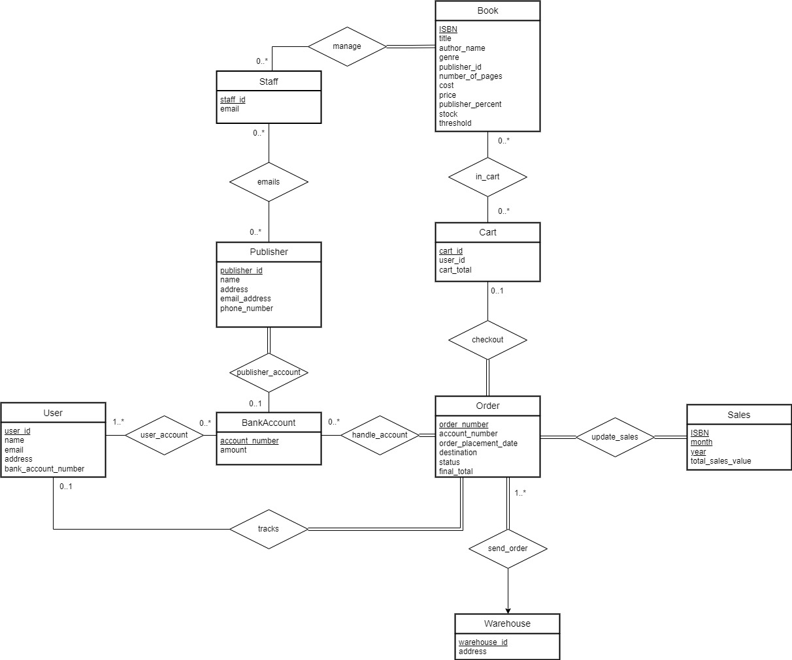
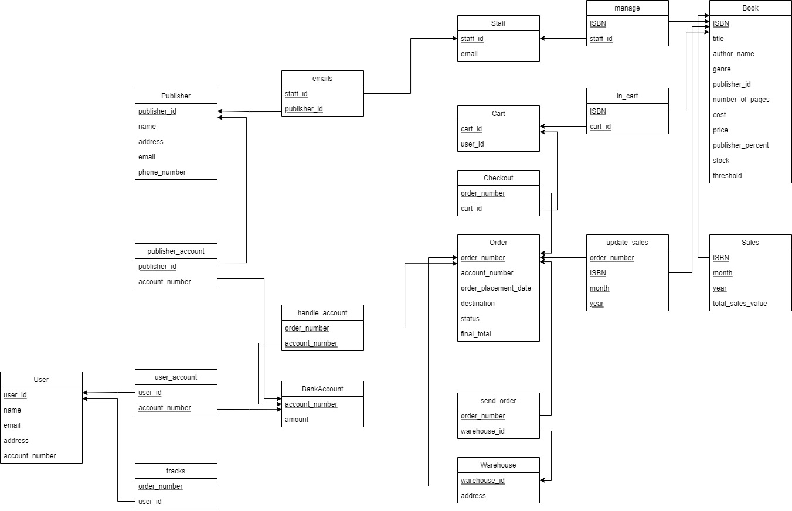

# LIBER

<p align="center">

</p>

by Bardia Parmoun and Christopher Shen

Released on: 12/20/2021

## Description

- Liber is an online bookstore which allows users to browse their favourite books and order them online.
- The users have the option of searching for the books using their title, ISBN, author name, and genre.
- LIBER also gives the staff the option of modifying the details for any books and it generates custom sales reports.

## Installaion

LIBER takes advantage of PostgreSQL and Apache servers. Proper installations of these softwares is required for LIBER to work properly.

1. Installing Apache (XAMPP):\
The recommended software for running an Apache server is an instance of the XAMPP (or LAMP) software. The latest version of XAMPP can be found here:\
[Install XAMPP](https://www.apachefriends.org/download.html)

2. Intalling PostgreSQL:\
LIBER was developed using PostgreSQL and as a result a proper installation of PostgreSQL is required. The latest version of this software can be found here:\
[Install PostgreSQL](https://www.postgresql.org/download/)

3. After PostgreSQL is installed make sure locate to the [SQL](https://github.com/bardia-p/LIBER/tree/master/SQL) folder to find the [dumpfile](https://github.com/bardia-p/LIBER/tree/master/SQL/Bookstore-dump.sql) for the Bookstore database.
4. Create a local version of that database and name it "Bookstore" and load the dump file.
5. Locate to the [liber-config.inc.php](https://github.com/bardia-p/LIBER/blob/master/includes/liber-config.inc.php) file to change the username and pass with your version.
6. Move the updated version of the repository under the "htdocs" folder in the installation folder for XAMPP. The path will most likely be the following for windows machines: 
```
C:\xampp\htdocs
```
## Running LIBER
1. Open XAMPP and start your Apache instance.
<p align="center">

</p>

2. Make sure your instance of PostgreSQL is running.
   
3. Once both the Apache server and the Postgres servers are running you can start the program by going to the following url:
```
http://localhost/liber/home.php
```

## Using LIBER
For a detailed explanation of how to navigate LIBER, please refer to the following video:\
[LIBER Demo](https://www.youtube.com/watch?v=47j_kePWlnQ&feature=youtu.be)

## LIBER Design Process
You can learn more about LIBER's design process through the following diagrams:
1. ER Diagram
<p align="center">

</p>

2. Schema Diagram
<p align="center">

</p>

3. Design Report \
Locate to [Design Report](https://github.com/bardia-p/LIBER/blob/master/documents/Project_Report.pdf) to learn more about the step by step process of designing and developing LIBER.

## CREDITS
Authors: Bardia Parmoun and Christopher Shen

Copyright © 2021 Bardia Parmoun & Christopher Shen. All rights reserved
